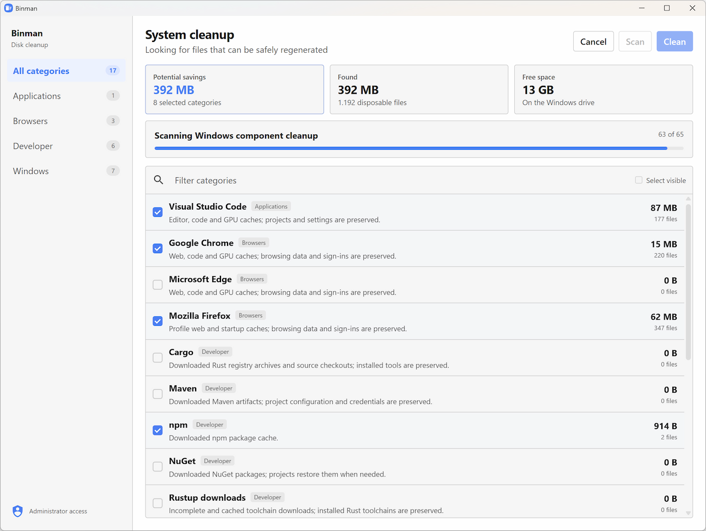

# Binman

A small Windows cleanup tool. It scans temporary files and caches, then lets you review what will be removed.

## Features

- Cleans Windows, browser, application, game and developer caches
- Shows sizes, file counts and warnings before cleanup
- Skips running applications when their state cannot be checked safely
- Supports protected Windows files, DISM, Docker and old Rust toolchains
- Uses cleanup rules from [`rules.json`](rules.json)
- Includes light and dark themes
- No telemetry, ads or bundled software

## Screenshot

## License

Copyright © 2026 [Bastiaan van der Plaat](https://github.com/bplaat)

Licensed under the [MIT](../../LICENSE) license.
