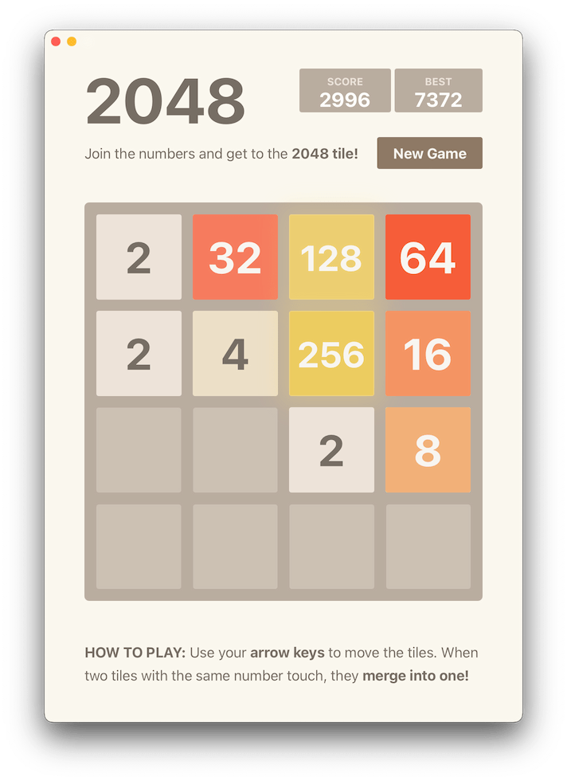

# 2048 Desktop App

An offline, fully native desktop 2048 game rendered with bwebview Canvas.

Use the arrow keys, WASD, or Vim movement keys to play. Mouse drag gestures are
also supported. Press `R` or choose **Game → New Game** on macOS to restart.

## Screenshot

## License

Copyright © 2014 [Gabriele Cirulli](https://github.com/gabrielecirulli)

Copyright © 2025 [Bastiaan van der Plaat](https://github.com/bplaat)

Licensed under the [MIT](../../LICENSE) license.
