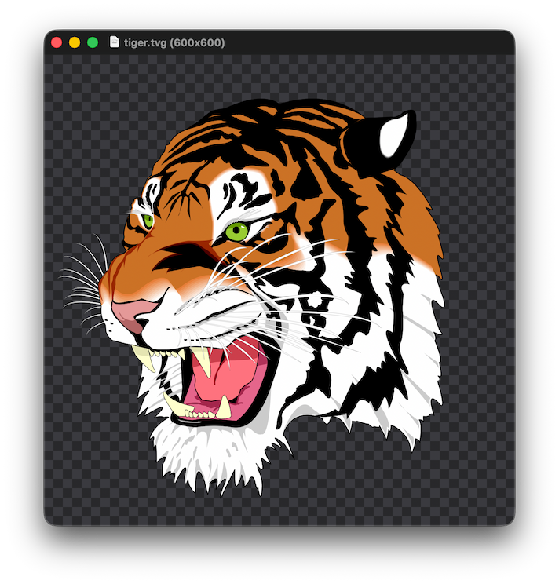

# MacView

A simple native macOS image viewer with support for SVG, QOI, and TinyVG images.

## Features

- View common image formats, SVG, QOI, and TinyVG files
- Zoom, pan, and fit images to the window
- Browse previous and next images in the same folder
- Print images at their natural size or scaled to fit
- Quick Look previews and thumbnails for supported formats

## macOS Entitlements

The main app does not use the `com.apple.security.app-sandbox` entitlement because `com.apple.security.files.user-selected.read-only` only permits reading the selected image, not the other images in the same folder. MacView needs access to those files to browse to the previous and next images.

## Screenshot

## License

Copyright © 2026 [Bastiaan van der Plaat](https://bplaat.nl/)

Licensed under the [MIT](../../LICENSE) license.
