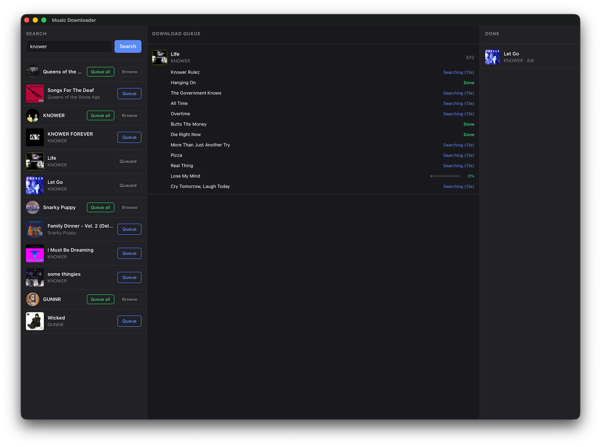

# Music Downloader

A tool that downloads complete albums from YouTube with the correct metadata from Deezer.
Run without arguments to open the GUI; pass arguments to use the CLI.

## Installation

First install [yt-dlp](https://github.com/yt-dlp/yt-dlp#installation) and [ffmpeg](https://ffmpeg.org/download.html), then:

```sh
cargo install --git https://github.com/bplaat/crates.git music-dl
```

## GUI usage

Launch without arguments to open the three-panel GUI:

```sh
music-dl
```

- **Search** - search Deezer for artists and albums; click Browse to drill into an artist's catalogue, Queue All to queue every album, or Queue to queue a single album
- **Download Queue** - shows live per-track progress (searching, downloading, writing metadata)
- **Done** - completed albums with success/total track counts

## CLI usage

List album track info:

```sh
music-dl list "Ordinary Songs 3"
```

Download an album (add `--with-cover` to also save cover art):

```sh
music-dl download "Ordinary Songs 3"
```

Download all albums from an artist (add `--with-singles` to include singles):

```sh
music-dl download --artist "Snail's House"
```

## Screenshot



## macOS Entitlements

The `com.apple.security.app-sandbox` entitlement is not used because random files need to be written to user Music directory.
