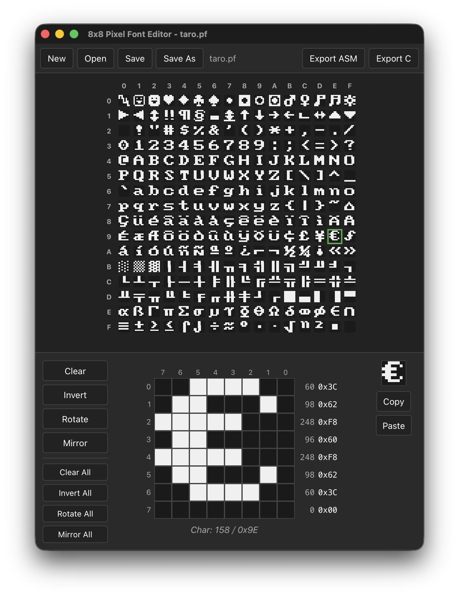

# Pixel Font Editor

An 8x8 pixel font editor built with [bwebview](../../lib/bwebview), a clone of the [8x8 Pixel Font Editor](https://www.min.at/prinz/o/software/pixelfont/) by Richard Prinz.

## Features

- Open and save `.pf` font files (flat binary, 256 chars x 8 bytes)
- 16x16 character grid showing all 256 characters
- Pixel-by-pixel editing with click and drag
- Per-character operations: Clear, Invert, Rotate (90 CW), Mirror (Horizontal/Vertical)
- Bulk operations: apply Clear/Invert/Rotate/Mirror to all 256 characters
- Copy hex bytes to clipboard / paste from clipboard
- Export as assembler file (`.asm`) or C header file (`.h`)

## Screenshot

