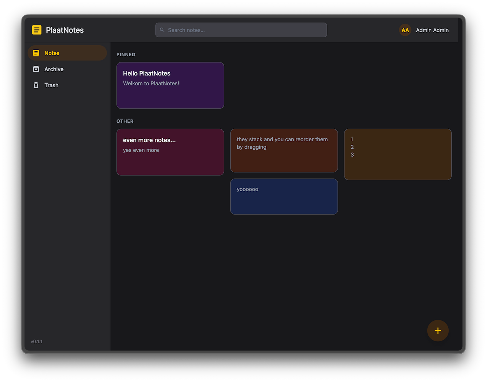

# PlaatNotes

A self-hosted note taking web app with rich markdown support

## Features

- Simple self-hosted in lightweight Docker container
- Rich markdown editor support
- Notes search, reordering and archiving
- Multiple users with authentication
- Google Keep Takeout import support

## Docker image

Example command to build the Docker image for PlaatNotes locally (from the root of the repository):

```sh
docker build -t ghcr.io/bplaat/plaatnotes:latest -f bin/plaatnotes/Dockerfile .
```

## Screenshot


