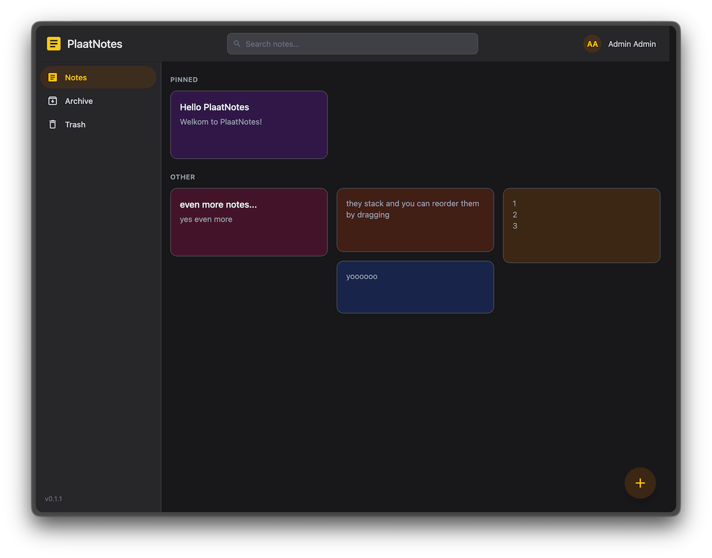

# PlaatNotes

A self-hosted note-taking web app with rich Markdown support.

## Features

- Simple self-hosted in lightweight Docker container
- Rich markdown editor support
- Notes search, reordering and archiving
- Multiple users support with user management
- Google Keep Takeout import support

## IP Geolocation Database

PlaatNotes resolves visitor IPs to city/country with a local [DB-IP City Lite](https://db-ip.com/db/download/ip-to-city-lite) database. On first startup it downloads the current month's database to `DATA_PATH`; if that fails, it uses ipinfo.io instead.

When PlaatNotes runs behind a reverse proxy, set `TRUSTED_PROXIES` to a comma-separated list of
proxy IP addresses. Forwarded client IP headers are ignored unless the direct connection comes from
one of these addresses.

## Docker image

Example command to build the Docker image for PlaatNotes locally (from the root of the repository):

```sh
docker build --platform linux/amd64,linux/arm64 --tag ghcr.io/bplaat/plaatnotes:latest --file bin/plaatnotes/Dockerfile .
```

## Screenshot



## License

Copyright © 2025-2026 [Bastiaan van der Plaat](https://bplaat.nl/)

Licensed under the [MIT](../../LICENSE) license.
