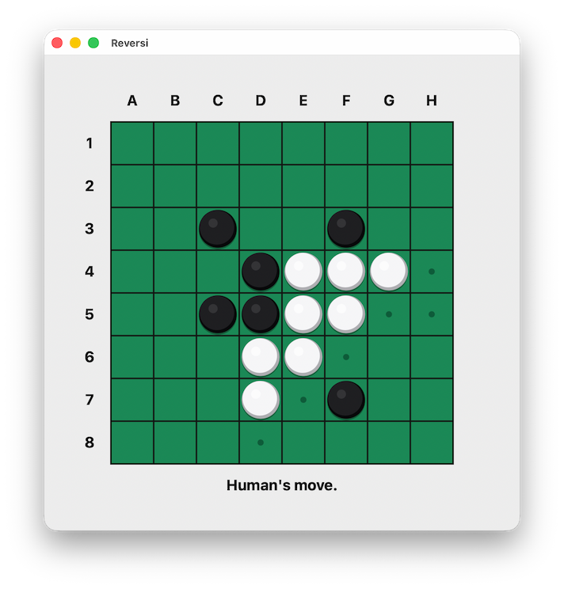

# Reversi

A native Reversi game built with [bwindow](../../lib/bwindow) and [bcanvas](../../lib/bcanvas).

## Features

- Play black against a background AI
- Legal-move hints and pointer feedback
- Light and dark themes following system appearance
- Resizable board with a fixed aspect ratio
- Native windowing and drawing on macOS, Windows, and Linux

## Screenshot

## Credits

The engine is derived from [Hans Wennborg's Othello implementation](https://www.hanshq.net/othello.html).

## License

Copyright © 2026 [Bastiaan van der Plaat](https://github.com/bplaat)

Licensed under the [MIT](../../LICENSE) license.
