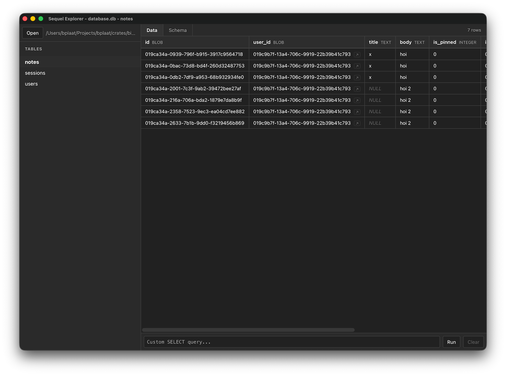

# Sequel Explorer

A simple SQLite database GUI viewer built with [bwebview](../../lib/bwebview) and [bsqlite](../../lib/bsqlite).

## Features

- Open any SQLite database file
- Browse tables in the sidebar
- View table schema (CREATE TABLE SQL)
- Run custom SELECT queries

## Screenshot

