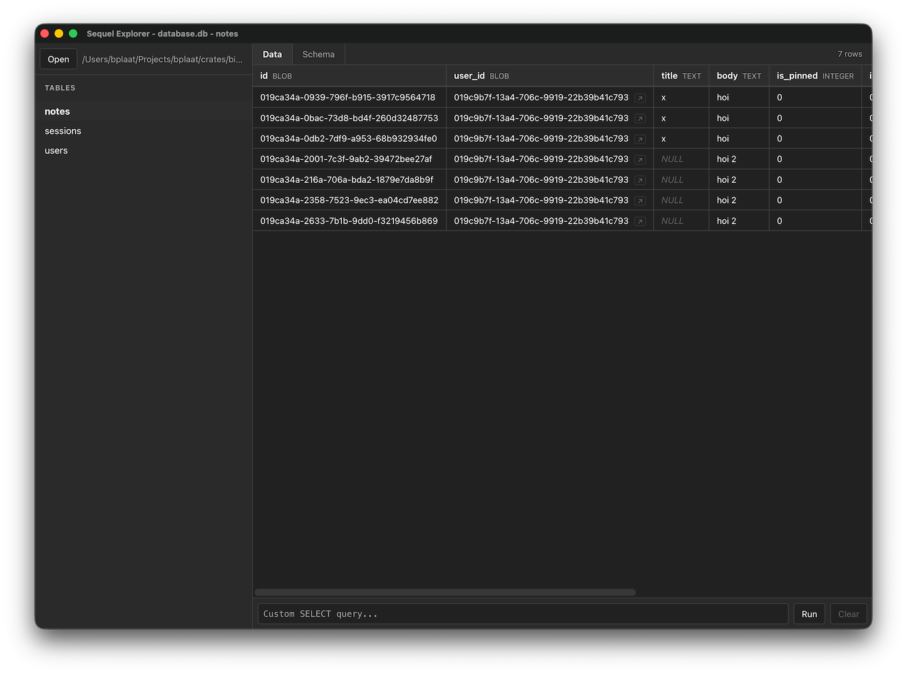

# Sequel Explorer

A simple SQLite database GUI viewer built with [bwebview](../../lib/bwebview) and [bsqlite](../../lib/bsqlite).

## Features

- Open any SQLite database file
- Browse tables in the sidebar
- View table schema (CREATE TABLE SQL)
- Run custom SELECT queries

## Screenshot

## macOS Entitlements

The `com.apple.security.app-sandbox` entitlement is not used because `com.apple.security.files.user-selected.read-only` only permits reading the selected file, not the accompanying `*-shm` and `*-wal` files next to the `.db` file.
