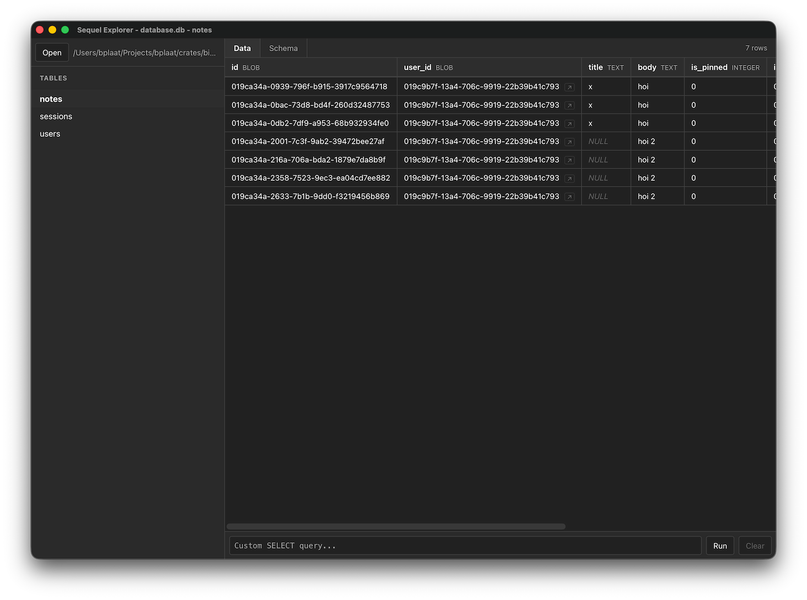

# Sequel Explorer

A read-only SQLite and MySQL database GUI viewer built with [bwebview](../../lib/bwebview) and
[bsql](../../lib/bsql).

## Features

- Open SQLite database files in read-only mode
- Connect to MySQL over TCP or a local Unix socket
- Browse the MySQL databases available to the connected account
- Browse tables in the sidebar
- Inspect table rows, declared column types, primary keys, and CREATE TABLE definitions
- Follow foreign-key references
- Run SELECT-only custom queries

## Screenshot

## macOS Entitlements

The `com.apple.security.app-sandbox` entitlement is not used because `com.apple.security.files.user-selected.read-only` only permits reading the selected file, not the accompanying `*-shm` and `*-wal` files next to the `.db` file.

## License

Copyright © 2026 [Bastiaan van der Plaat](https://github.com/bplaat)

Licensed under the [MIT](../../LICENSE) license.
