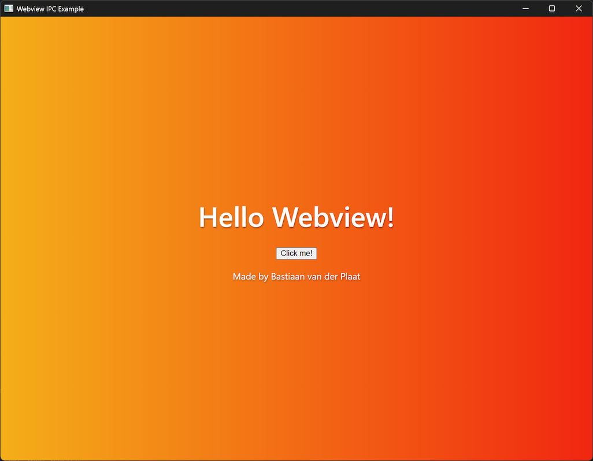
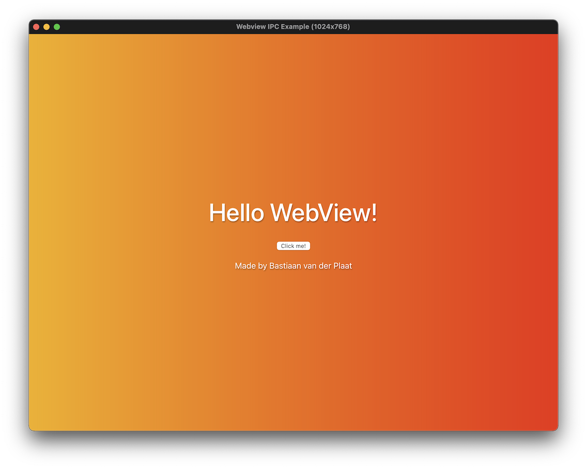
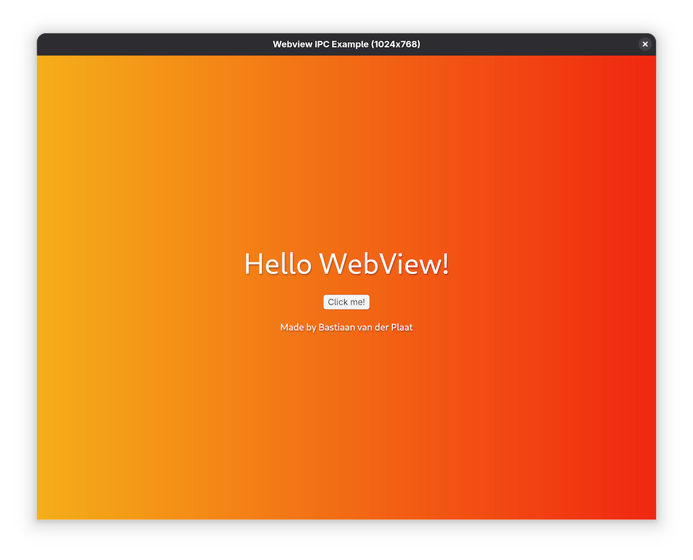

# Bassie Webview Rust library

A cross-platform webview library for Rust with minimal dependencies

## Getting Started

On some platforms, you may need to install additional dependencies before using this library:

### Linux (Debian/Ubuntu)

```sh
sudo apt install libgtk-3-dev libwebkit2gtk-4.1-dev
sudo apt install libgtk-3-dev libwebkit2gtk-4.0-dev # for older systems
```

### Linux (Fedora)

```sh
sudo dnf install gtk3-devel webkit2gtk4.1-devel
sudo dnf install gtk3-devel webkit2gtk4.0-devel # for older systems
```

## Platforms

| Platform    | Backend                        | Notes                                     |
| ----------- | ------------------------------ | ----------------------------------------- |
| Windows     | WebView2 (Chromium/Edge)       | Requires WebView2 Runtime to be installed |
| macOS       | WKWebView (WebKit)             | macOS 11.0+                               |
| Linux/other | WebKitGTK (GTK 3 + WebKit2GTK) | See GTK tiers below                       |

### Linux / GTK tiers

The Linux backend automatically selects the best available WebKitGTK version at build time:

| WebKitGTK package | Min version | GTK min | Distro (stock packages) | Notes                                    |
| ----------------- | ----------- | ------- | ----------------------- | ---------------------------------------- |
| `webkit2gtk-4.1`  | 2.40        | 3.22+   | Ubuntu 22.04+           | Modern API; full custom-protocol support |
| `webkit2gtk-4.0`  | 2.22        | 3.18+   | Ubuntu 18.04+           | JSC GLib API; URI-only custom protocol   |
| `webkit2gtk-4.0`  | 2.20        | 3.18+   | Ubuntu 16.04+           | Legacy JavaScriptCore C API              |

## Screenshots

<table>
<tr>
<td align="center">

<br>
<a href="examples/ipc/">IPC example</a> running on Windows
</td>
<td align="center">

<br>
<a href="examples/ipc/">IPC example</a> running on macOS
</td>
<td align="center">

<br>
<a href="examples/ipc/">IPC example</a> running on Linux (GTK)
</td>
</tr>
</table>

## Features

- **log** Enables logging support by forwarding `console.*` calls to the `log` crate (default).
- **remember_window_state** Adds remembers window position and size between launches options (default).
- **rust-embed** Adds support for serving embedded assets using the `rust-embed` crate.
- **custom_protocol** Adds support for custom protocols, allowing you to serve content from custom URL schemes.
- **file_dialog** Adds support for file dialogs, allowing you to open file selection dialogs from your webview.

## Sources binary blobs

- `webview2/{arm64, x64, x86}/` [Microsoft.Web.WebView2 nuget](https://www.nuget.org/packages/Microsoft.Web.WebView2/)
- `webview2/*.winmd` [Microsoft.Web.WebView2 win32 windmd generator](https://github.com/wravery/webview2-win32md/tree/main)

## License

Copyright © 2025-2026 [Bastiaan van der Plaat](https://github.com/bplaat)

Licensed under the [MIT](../../LICENSE) license.
