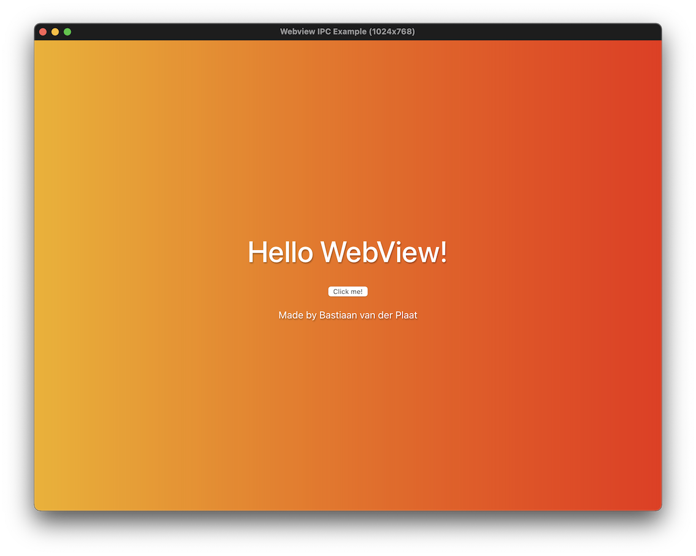
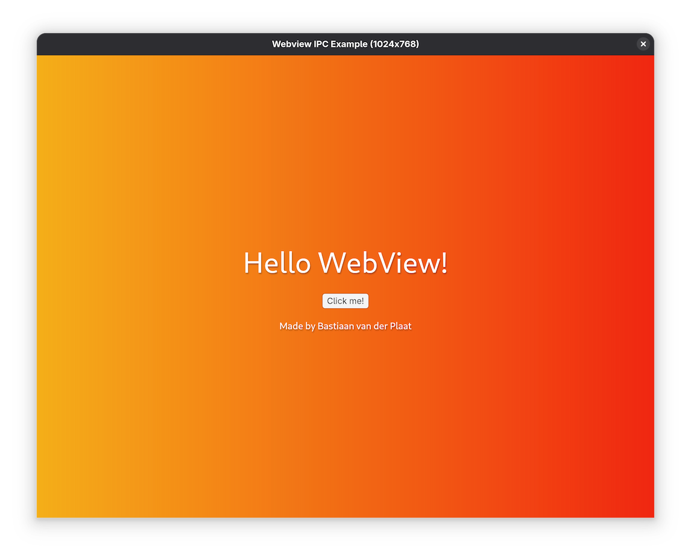

# Tiny Webview Rust library

A cross-platform webview library for Rust, that uses zero dependencies and is designed to be small and efficient.

## Getting Started

On some platforms, you may need to install additional dependencies before using this library:

### Linux (Debian/Ubuntu)

```sh
sudo apt install libgtk-3-dev libwebkit2gtk-4.1-dev
```

### Linux (Fedora)

```sh
sudo dnf install gtk3-devel webkit2gtk4.1-devel
```

## Screenshots

<table>
<tr>
<td align="center">

<br>
<a href="examples/ipc/">IPC example</a> running on macOS
</td>
<td align="center">

<br>
<a href="examples/ipc/">IPC example</a> running on Linux (GTK)
</td>
</tr>
</table>

## License

Copyright © 2025 [Bastiaan van der Plaat](https://github.com/bplaat)

Licensed under the [MIT](../../LICENSE) license.
